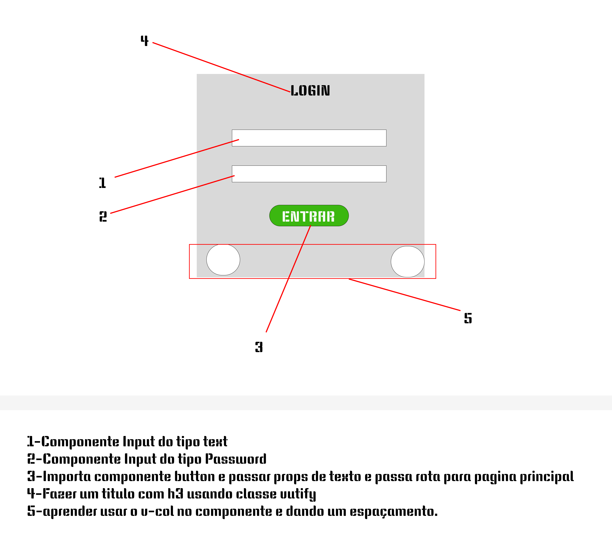

# app




<h4>Componente do Botão >   https://v2.vuetifyjs.com/en/components/buttons/#usage</h4>

<h4>Troca de Fontes >  https://vuetifyjs.com/en/styles/text-and-typography/</h4>


## Project setup
```
npm install
```

### Compiles and hot-reloads for development
```
npm run serve
```

### Compiles and minifies for production
```
npm run build
```

### Lints and fixes files
```
npm run lint
```

### Customize configuration
See [Configuration Reference](https://cli.vuejs.org/config/).
